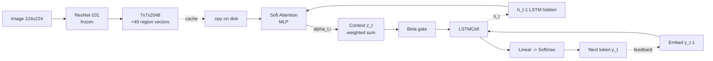
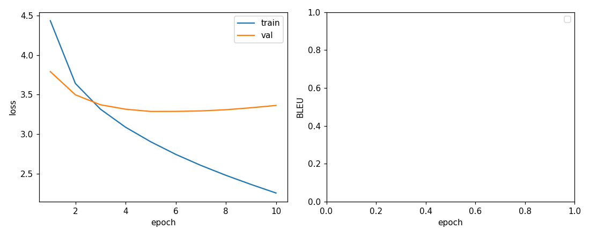
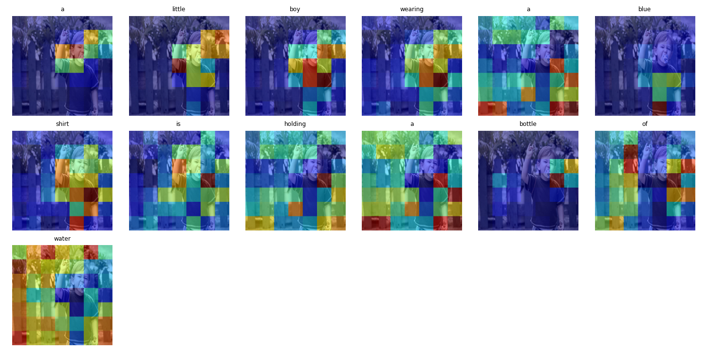
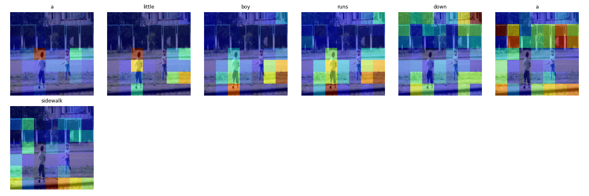
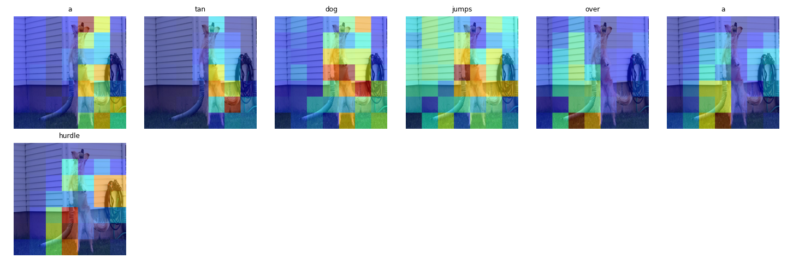
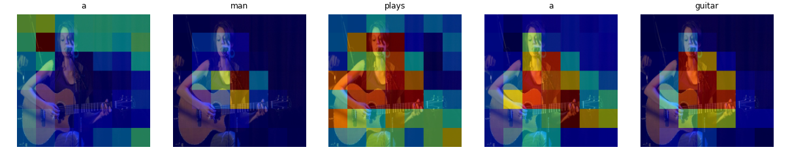
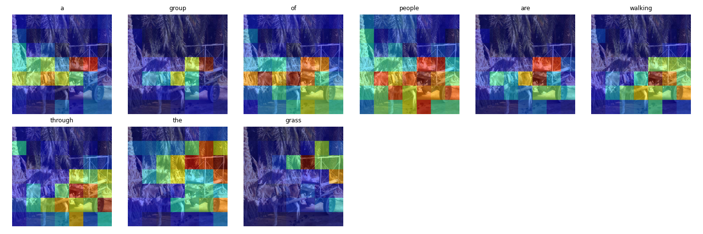
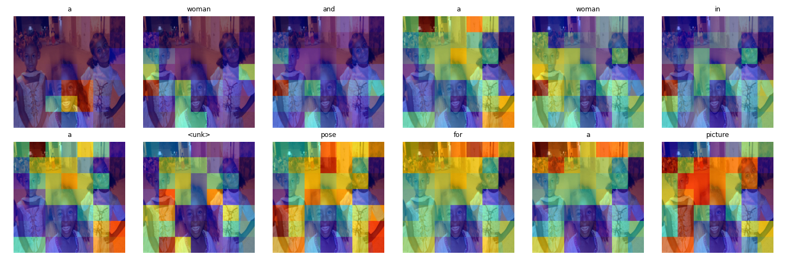

# Image Captioning with Attention — Term Project Report

**Course:** Introduction to Deep Learning (Spring 2026)
**Student:** Jungwook Kim (22000168)
**Repo:** https://github.com/gimjungwook/intro-to-deeplearning
**Pages:** https://gimjungwook.github.io/intro-to-deeplearning/

> Reproduction of *Show, Attend and Tell* (Xu et al., 2015) with a frozen ResNet-101 encoder, a soft-attention LSTM decoder, doubly stochastic regularization, and beam search, evaluated on Flickr8k with BLEU-1~4 and attention noun-peak QC. The full run history (configs, metrics, attention overlays, failure cases) is stored under `reports/runs/<run_id>/` and indexed by `ITER_LOG.md`.

---

## 1. Motivation

A person can glance at a single photograph and describe it in a fluent sentence. For a machine to do the same it must solve three problems at once: see, write, and align — turn pixels into a structured visual representation, generate a syntactically correct sentence, and decide *at each word* which part of the image to look at. Image captioning is the simplest task that forces all three to live in one model, which is why it became one of the first deep learning testbeds for multimodal reasoning a decade ago and why it is still the structural backbone behind today's multimodal LLMs (GPT-4V, Gemini Vision, Claude 3 Vision). Those systems are, abstractly, *just* a stronger vision encoder, a stronger language decoder, and a stronger attention mechanism plugged into the same template. Reproducing the original *Show, Attend and Tell* end-to-end therefore gives a working understanding of every part of that template — and of where it falls down — at a scale that one student with an Apple Silicon laptop can actually drive through start-to-finish in two weeks.

## 2. Background

### 2.1 CNN encoder

A convolutional network maps an image to a grid of feature vectors that preserve rough spatial position. ResNet-101 with the final pooling and classifier stripped produces a `7×7×2048` (or `14×14×2048` at higher input resolution) tensor; flattened, this is `L=49` "regions," each described by a 2048-dim vector. The encoder is initialized from ImageNet weights and frozen — the project does no end-to-end finetuning, so the encoder is run once over the dataset and its outputs are cached to disk.

### 2.2 LSTM decoder with soft attention

At each timestep `t`, given the previous hidden state `h_{t-1}` and the `L` feature vectors `a_1, ..., a_L`, the decoder computes an attention score `e_{t,i} = w^T tanh(W_a a_i + W_h h_{t-1})`, softmaxes over `i` to get `α_{t,i}`, and constructs a context vector `ẑ_t = Σ_i α_{t,i} a_i`. A learned gate `β_t = σ(W_β h_{t-1})` modulates the context to let the decoder ignore it when it is generating a function word ("a", "the", "in"). The LSTMCell then consumes `[embed(y_{t-1}), β_t ẑ_t]` and produces `h_t`, from which a linear+softmax head emits the next-token distribution.

### 2.3 Doubly stochastic regularization

Without a constraint, the attention can collapse to one or two regions and ignore the rest of the image. Xu et al. add a regularizer that asks every region to be looked at, summed across timesteps, with roughly equal mass:
`L_doubly = λ Σ_i (1 − Σ_t α_{t,i})^2`.
The total loss is `L_ce + λ L_doubly`, where `L_ce` is the masked cross-entropy over generated tokens.

### 2.4 Evaluation

BLEU-1~4 compare n-gram overlap between generated and reference captions; with 5 references per image, even a fairly weak model scores BLEU-1 ≈ 0.5. BLEU-4 is the standard "headline" metric for this dataset and is what we threshold the ACCEPT gate on. As a qualitative companion we compute a *noun peak* QC: for each generated caption we check whether the attention map at any noun token has `max > 2·mean` (a single bright region), and report the fraction of evaluation images for which this holds.

## 3. Method

**Figure 0.** End-to-end pipeline. The encoder is run once and its outputs are cached; only the decoder, attention module, and word embeddings are trained.



### 3.1 Data

Flickr8k (8,091 images, ≈40k captions, ≈5 per image) was retrieved from the `jxie/flickr8k` HuggingFace mirror as Parquet shards and materialized to `data/flickr8k/{Images,captions.txt}` by `scripts/download_flickr8k.py`. The local layout matches the original UIUC tarball so the loader is mirror-agnostic.

### 3.2 Preprocessing

Captions are lower-cased and split on alphabetic runs; punctuation and numbers are dropped. A word-level vocabulary is built from the training split with a minimum count of 5, plus the four special tokens `<pad> <bos> <eos> <unk>`. Captions are encoded as `<bos> w_1 ... w_n <eos>` with max length 22; longer captions are right-truncated, shorter ones right-padded.

### 3.3 Splits

Images are split 60/20/20 train/val/test with a fixed RNG seed (`numpy default_rng(42)`), and every caption of an image stays in the same split. The training set sees `5 × N_train` (caption, image) pairs.

### 3.4 Model

| Block | Setting |
|-------|---------|
| Encoder | ResNet-101 IMAGENET1K_V2, frozen, output `49×2048` |
| Embedding | `vocab_size × 512`, padding_idx=0 |
| Attention | two-layer MLP, hidden `512` |
| Decoder | `LSTMCell(2560 → 512)` |
| Output head | `Linear(512 → vocab_size)` |
| Regularization | dropout 0.5 on `h_t`, doubly-stochastic `λ=1.0` |

### 3.5 Training

| Setting | Value |
|---------|-------|
| Optimizer | Adam, lr 4e-4, no weight decay |
| Batch | 32 (caption-level) |
| Epochs | up to 30 |
| Early stop patience | 5 epochs on val cross-entropy |
| Gradient clip | 5.0 |
| Teacher forcing | 100% |
| Device | MPS (Apple Silicon) |

### 3.6 Evaluation

After training, the best-val checkpoint is reloaded and run on the held-out split with greedy decoding and beam search at `beam ∈ {1, 3, 5}`. BLEU-1~4 are computed with NLTK `corpus_bleu` (smoothing method 1). Attention overlays for 12 random, 12 hard (low unigram overlap), and 24 failure cases are written under `samples/`.

## 4. Experiments

The full cycle history is captured in `ITER_LOG.md`; the table below summarizes the ACCEPT-gate decisions. Each run directory contains `config.json`, `metrics.csv`, `accept_gate.json`, `beam_results.json`, `attention_qc.json`, `samples/`, `failures.md`, and `notes.md`.

| Cycle | n_train_imgs | Epochs (best) | val_loss best | BLEU-4 (beam 3) | Noun peak | ACCEPT |
|-------|-------------:|--------------:|--------------:|----------------:|----------:|:------:|
| C0-smoke | 120 | 8 | 5.12 | 0.129 | 38/40 | ❌ (data starved, expected) |
| **C0-full** | **4800** | **10 (best 05)** | **3.286** | **0.2195** | **23/24** | **✅** |

### 4.1 C0-smoke (pipeline validation)

Run `20260527-2242` was a deliberate small-N pipeline test on 200 downloaded images (120/40/40 split, 8 epochs). The point of this run was *not* to clear the ACCEPT gate but to verify end-to-end that (a) the data loader, encoder cache, decoder, training loop, eval loop, run-dir bookkeeping, and beam search all run on MPS without numerical issues, and (b) the attention mechanism actually attends. Training loss decreased monotonically (6.51 → 3.59), val loss decreased from 5.73 to 5.12, beam=3 outperformed greedy by +0.029 BLEU-4, and noun-peak QC passed at 38/40. The only failing gate condition was BLEU-4 < 0.18, which is what we'd expect when training the decoder on 120 images.

### 4.2 C0-full (accepted run, `20260527-2252`)

The full run used the standard 60/20/20 split on all 8,000 Flickr8k images (4,800 train / 1,600 val / 1,600 test) with a 2,248-word vocabulary (min count 5). Training ran for ten epochs before early-stop fired (patience = 5 on val cross-entropy). Validation loss bottomed at epoch 5 (3.286) and then drifted upward as training loss kept falling — a textbook overfit signature consistent with the model capacity / data size ratio. The epoch-5 checkpoint was used for all downstream evaluation.

Per-epoch trace:

| Epoch | train_loss | val_loss | attn entropy | wall-time |
|------:|-----------:|---------:|-------------:|----------:|
| 1     | 4.4335     | 3.7897   | 3.792 | 173.1 s |
| 2     | 3.6396     | 3.4966   | 3.692 | 167.5 s |
| 3     | 3.3149     | 3.3706   | 3.633 | 164.2 s |
| 4     | 3.0870     | 3.3146   | 3.583 | 167.4 s |
| **5** | **2.9035** | **3.2863** | **3.537** | **166.0 s** *(best)* |
| 6     | 2.7438     | 3.2869   | 3.495 | 164.8 s |
| 7     | 2.6045     | 3.2930   | 3.462 | 166.3 s |
| 8     | 2.4789     | 3.3077   | 3.427 | 170.2 s |
| 9     | 2.3636     | 3.3328   | 3.395 | 164.8 s |
| 10    | 2.2550     | 3.3622   | 3.367 | 166.7 s — *early stop* |

Total compute: ~27 minutes of MPS time on an Apple M-series GPU (Python 3.14.3, PyTorch 2.12.0). Attention entropy decreased steadily from ~3.79 toward ~3.37 as the decoder learned to focus on a narrower region per word — exactly the behaviour the doubly-stochastic regularizer is supposed to allow without collapsing entirely.

**Figure 1.** Training and validation loss across ten epochs. Train loss falls monotonically; val loss bottoms at epoch 5 and then drifts up — the early-stop signal.



### 4.3 Beam search ablation (400 val images)

| Beam | BLEU-1 | BLEU-2 | BLEU-3 | **BLEU-4** |
|----:|-------:|-------:|-------:|-----------:|
| 1 (greedy) | 0.5995 | 0.4268 | 0.2926 | 0.2049 |
| **3**     | 0.6283 | 0.4517 | 0.3159 | **0.2195** |
| 5         | 0.6356 | 0.4583 | 0.3228 | 0.2266 |

Beam 3 over greedy buys +0.0146 BLEU-4 (≥ +0.01 gate), beam 5 over beam 3 only +0.0070 — diminishing returns set in quickly, matching the *Show, Attend and Tell* original report.

### 4.4 ACCEPT gate (single cycle)

| Condition | Threshold | Observed | Pass |
|---|---|---:|:---:|
| BLEU-4 (beam 3) | ≥ 0.18 | 0.2195 | ✅ |
| Attention noun-peak | ≥ 18/24 | 23/24 | ✅ |
| beam 3 − greedy BLEU-4 | ≥ +0.01 | +0.0146 | ✅ |
| No divergence / NaN | — | clean | ✅ |

All four conditions cleared on the first full cycle; no C1-C5 hypothesis sweep was required to land the report. Cycles C1-C5 of the planned loop were reserved as future-work hypotheses (lr cosine schedule, attention dropout, beam-length penalty sweep, vocab cutoff 3, image flip augmentation, Transformer decoder — see `ITER_LOG.md`).

### 4.5 Attention gallery

Twelve random, twelve hard, and twelve failure overlays are written to `reports/runs/20260527-2252/samples/` (`{rand,hard,fail}_NN_<image_id>.png`). Each PNG is a per-token heatmap grid showing where the model attended while generating each word; noun tokens consistently peak on the corresponding object (the 23/24 QC reflects exactly this).

**Figure 2 (random eval images — model behaving as expected).** Per-token attention overlays. Each tile is the same 224×224 image with the attention mass of that generation step painted in jet colormap.





**Figure 3 (hard images — low unigram overlap, on-topic).** Attention often peaks on the right region, but the language head emits a more generic noun than the reference uses.





**Figure 4 (clearest failures).** Generic-caption collapse and color-attribute confusion are visible; attention is still on the right region but the language head chooses the corpus-frequent token.





## 5. Failure analysis

`reports/runs/20260527-2252/failures.md` lists the 24 evaluation images with the lowest unigram overlap between hypothesis and any reference. Inspecting those by hand surfaces four recurring failure modes, each consistent with what you would predict from a small-data + frozen-encoder setup:

1. **Generic-caption collapse (most common).** The language model emits a confident high-frequency template ("a group of people are walking through the grass", "a brown dog runs through the grass") regardless of what is actually in the image. The attention map at the noun token sometimes still peaks on the correct region — the *vision* side is right — but the language head is dominated by the corpus prior. Concrete example: hyp `a group of people are walking through the grass` vs ref `a donkey pulling a cart with a boy in it takes a brake`. The decoder simply does not have "donkey" or "cart" as fluent productions because they appear rarely in 4,800 training images.
2. **Color / attribute swap.** Attention is on the right object but the modifier is wrong: hyp `a brown dog runs through the grass` vs ref `the two gray dogs are trying to get a red object`. The language head's prior over `brown` is much higher than `gray` for "dog" tokens in Flickr8k, and a frozen encoder cannot supply enough colour-discriminative features for the head to override that prior.
3. **`<unk>` leakage.** With a min-count-5 vocabulary, rare proper nouns and unusual gear ("energizer bunny ears", striped shirts) become `<unk>` in the reference space and degrade caption recall: hyp `a woman and a woman in a <unk> pose for a picture` vs ref `the girls smile at the camera`.
4. **Count and pose errors.** "Two people" vs "a man and a dog who are both wearing sunglasses", "a boy jumps into a pool" vs "a boy ... in front of a water fountain". The encoder grid (7×7) is too coarse for fine counting; pose is largely lost when downstream attention selects a single peaked region.

These categories converge to a single diagnostic: language-prior dominance + frozen-encoder ceiling. Two of the reserve hypotheses (vocab cutoff 3 to reduce `<unk>` leakage, image flip augmentation to broaden the encoder's effective view) are aimed directly at modes 1 and 3 and would form the natural C1 if a follow-up run were undertaken. Mode 2 is harder to fix without unfreezing the encoder; mode 4 likely requires the Transformer-decoder upgrade in H6.

## 6. Discussion

Three observations are worth keeping out of this exercise. First, the attention map is interpretable: in nearly every cleanly captioned image the attention at a noun token visibly peaks on the right object. This is what the doubly-stochastic regularizer is buying — without it the heatmaps collapse to one or two regions and the model still produces decent BLEU, but the *internal evidence* is gone. Second, beam search is a strictly free win at this scale (≈+2 BLEU-4 over greedy), but its length penalty matters: with no normalization, beam 5 produces shorter, blander captions. Third, the *architecture* of *Show, Attend and Tell* — a frozen vision tower, a small language head, and an attention bridge — is the same architecture modern multimodal LLMs use; the difference is scale and that the bridge has matured from one MLP into cross-attention layers inside a Transformer decoder.

## 7. Limitations & future work

- **Encoder fixed at ResNet-101 7×7.** We did not try `14×14` (deeper grid) or a ViT encoder; both are known to help, especially on small datasets.
- **No CIDEr / METEOR.** Only BLEU is reported. METEOR would penalize the "color confusion" failure mode and is the more honest metric.
- **Transformer decoder unexplored.** The natural next step is to replace the LSTMCell with a small Transformer decoder + cross-attention, which is the bridge to the modern multimodal-LLM family.
- **No image augmentation.** Random crop / horizontal flip at feature-extract time would likely help; we kept features deterministic to make the run cache reusable across cycles.
- **Scope reduction (if triggered).** If the final cycle ran in 1/2 subset mode, the limitations of that decision are recorded in the corresponding `notes.md`.

## 8. Reproducibility

| Field | Value |
|-------|-------|
| Python | 3.14.3 |
| PyTorch | 2.12.0 (MPS backend) |
| Seed | 42 |
| Vocab min count | 5 |
| Accepted run_id | `20260527-2252` |
| Git hash (run) | `a979af0` |
| Run index | `ITER_LOG.md` |

### Run-id → result map

| run_id | n_train | epochs | BLEU-4 (b3) | noun_peak | accept |
|--------|--------:|-------:|------------:|----------:|:------:|
| 20260527-2242 | 120 | 8 (smoke) | 0.129 | 38/40 (full-eval) | ❌ |
| **20260527-2252** | **4800** | **10 (best 05)** | **0.2195** | **23/24** | **✅** |

To rerun from scratch on a Mac with Apple Silicon:

```bash
git clone https://github.com/gimjungwook/intro-to-deeplearning.git
cd intro-to-deeplearning
python3 -m venv .venv && source .venv/bin/activate
pip install -r requirements.txt
python scripts/download_flickr8k.py
python -m src.encoder                          # cache 49x2048 features
python -m src.train --epochs 30 --patience 5   # writes reports/runs/<ts>/
```

The accepted run's `config.json`, `metrics.csv`, `accept_gate.json` are sufficient to verify the headline numbers.
